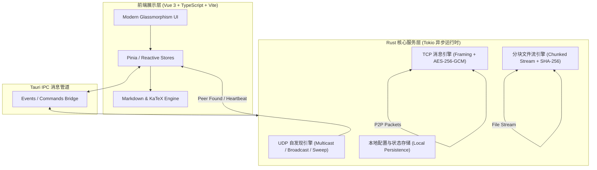
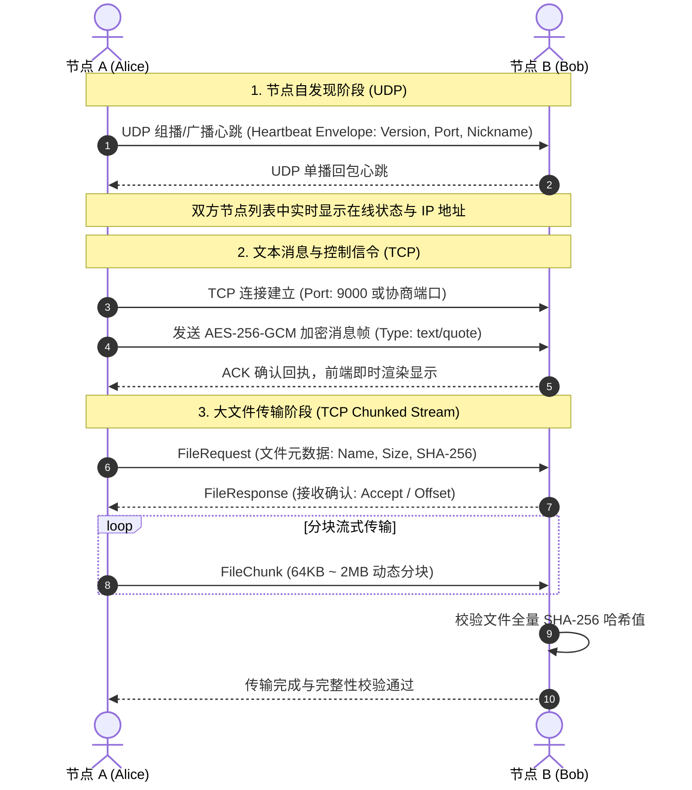

<div align="center">

# 🚀 LanChat

**基于 Tauri v2 + Vue 3 + Rust 构建的下一代局域网免服务器 P2P 聊天与极速文件传输系统**

*Next-Generation Serverless P2P LAN Messenger & High-Speed File Transfer Built with Tauri v2, Vue 3, and Rust*

[](https://github.com/2542068503/LanChat/actions/workflows/ci.yml)
[](https://github.com/2542068503/LanChat/releases)
[](LICENSE)
[](https://tauri.app)
[](https://vuejs.org)
[](https://www.rust-lang.org)
[](CONTRIBUTING.md)

[English](#-english-overview) | [简体中文](#-核心特性)

</div>

---

## 🌟 核心特性 (Key Features)

- 📡 **免服务器 & 零配置自发现 (Zero-Config Auto-Discovery)**
  - 采用 **UDP 组播 (239.255.0.1:9000)**、**局域网广播 (255.255.255.255:9000)** 与 **自适应子网巡检 (Subnet Sweep)** 混合机制，设备接入局域网瞬间上线并自动发现邻近节点，无须任何中央服务器。
- 💬 **点对点私聊与全网大厅广播 (P2P Private & Lobby Broadcast)**
  - 支持单节点 1-on-1 端对端加密私密通信，以及针对局域网全体节点的大厅公共广播。
- ⚡ **超高速分块文件传输 (Chunked File Streaming)**
  - 支持 GB 级超大文件无损流式传输，实时计算传输速率、进度百分比与预计剩余时间 (ETA)。
- 🛡️ **传输完整性与加密安全 (End-to-End Cryptographic Security)**
  - 通讯协议采用 **AES-256-GCM** 对称加密封包。
  - 文件传输全程执行 **SHA-256** 散列哈希校验，杜绝任何网络丢包篡改。
- 📐 **专业级 Markdown 与 KaTeX LaTeX 数学公式渲染**
  - 内置轻量安全 Markdown 语法解析器与 KaTeX 公式引擎，完美渲染学术论文公式、代码高亮块与图文混排。
- ⌨️ **极客级效率交互体验**
  - 支持 `Ctrl+Tab` 仿浏览器 Tab 列表极速轮询切换联系人。
  - 支持自定义头像（预设与 Base64 本地上传）、网络适配器多网卡切换与开机自启。
- 🔒 **纯本地持久化，隐私零泄露**
  - 所有聊天记录、节点配置全部存储于本机操作系统安全数据路径，不经过任何第三方云服务。

---

## 🏗️ 架构设计 (Architecture)

LanChat 采用前后端分离的现代化架构，前端专注于高响应度的响应式 UI，Rust 后端托管异步网络运行时。



### 传输交互时序 (Protocol Flow)



---

## 🛠️ 技术栈 (Tech Stack)

| 领域 | 技术 / 库 | 用途 |
| --- | --- | --- |
| **GUI 架构** | [Tauri v2](https://tauri.app/) | 轻量化、高安全、极低内存占用的跨平台应用容器 |
| **前端框架** | [Vue 3](https://vuejs.org/) (Composition API) | 响应式组件与用户界面构建 |
| **前端语言** | [TypeScript](https://www.typescriptlang.org/) | 强类型安全与高可维护性保障 |
| **构建工具** | [Vite](https://vitejs.dev/) | 毫秒级极速前端热更新与打包 |
| **图标与视觉**| [Lucide Vue Next](https://lucide.dev/) | 现代极简扁平化矢量图标集 |
| **文档与排版**| [Marked](https://marked.js.org/) + [KaTeX](https://katex.org/) + [DOMPurify](https://github.com/cure53/DOMPurify) | Markdown 解析、LaTeX 公式渲染与 XSS 净化 |
| **后端语言** | [Rust (2021 Edition)](https://www.rust-lang.org/) | 高并发、零成本抽象与内存安全核心 |
| **异步运行时**| [Tokio](https://tokio.rs/) | 高性能异步 I/O 引擎与并发调度器 |
| **底层网络** | [Socket2](https://crates.io/crates/socket2) | 底层 Socket 精细化参数配置 (SO_BROADCAST, MULTICAST_TTL) |
| **网络加密** | [AES-256-GCM](https://crates.io/crates/aes-gcm) + [Sha2](https://crates.io/crates/sha2) | 报文加解密认证与端到端散列完整性校验 |

---

## 📂 目录结构 (Directory Structure)

```text
LanChat/
├── .github/
│   ├── ISSUE_TEMPLATE/     # 社区问题与特性需求结构化模板
│   └── workflows/
│       ├── ci.yml          # GitHub Actions 持续集成自动化工作流
│       └── publish.yml     # 多平台安装包自动构建发布流水线
├── docs/                   # 历史规范文档与设计草案
├── public/                 # 公共静态资源与应用图标
├── scripts/
│   └── bump_version.mjs    # 全局版本号联动升级自动化脚本
├── src/                    # 前端代码目录 (Vue 3 + TypeScript)
│   ├── assets/             # 样式文件 (main.css) 与预设头像资源
│   ├── components/         # 界面核心组件 (ChatArea, Sidebar, Settings, Modals)
│   ├── composables/        # 响应式业务组合式函数 (useChat, useFileTransfer, useNetwork)
│   ├── store.ts            # 全局响应式状态管理
│   ├── types.ts            # TypeScript 核心数据类型定义
│   └── App.vue             # 应用主视图入口
├── src-tauri/              # Rust 核心后端 (Tauri v2)
│   ├── capabilities/       # Tauri v2 细粒度安全权限能力声明
│   ├── src/
│   │   ├── crypto/         # AES-256-GCM 加解密与 SHA-256 完整性计算模块
│   │   ├── network/        # UDP 组播自发现、TCP 帧通信、分块文件流
│   │   ├── protocol/       # 信令封包结构、心跳协议、消息实体
│   │   ├── state.rs        # 后端线程安全并发全局状态 (AppState)
│   │   └── lib.rs          # Tauri Command 注册与应用生命周期钩子
│   ├── Cargo.toml          # Rust 依赖声明
│   └── tauri.conf.json     # Tauri 运行时配置 (窗口属性、权限范围)
├── CONTRIBUTING.md         # 开源贡献指南 (中英双语)
├── CODE_OF_CONDUCT.md      # 社区行为准则 (Contributor Covenant v2.1)
├── SECURITY.md             # 安全策略与漏洞报告指引
├── LICENSE                 # 开源许可协议 (MIT License)
├── package.json            # 前端依赖与脚本
└── README.md               # 项目主说明文档
```

---

## 🚀 快速开始 (Quick Start)

### 1. 环境准备 (Prerequisites)

在开始前，请确保您的本地计算机已安装：
- **Node.js**: >= 18.0.0
- **pnpm**: >= 9.0.0 (推荐 `corepack enable` 或 `npm install -g pnpm`)
- **Rust & Cargo**: >= 1.77.0 (通过 [rustup.rs](https://rustup.rs/) 安装)
- **C++ 编译套件**:
  - Windows: Visual Studio C++ 生成工具
  - Linux: `sudo apt install libwebkit2gtk-4.1-dev build-essential curl wget file libssl-dev libayatana-appindicator3-dev librsvg2-dev`
  - macOS: Xcode Command Line Tools (`xcode-select --install`)

### 2. 获取代码与安装依赖

```bash
git clone https://github.com/2542068503/LanChat.git
cd LanChat

# 安装前端依赖
pnpm install
```

### 3. 运行开发环境

```bash
pnpm tauri dev
```
此命令将启动 Vite 本地开发服务器，并拉起本地 Tauri 原生桌面应用窗口，支持前端热重载与 Rust 后端增量编译。

### 4. 运行测试套件

```bash
# 运行 Rust 后端单元测试
cd src-tauri && cargo test && cd ..

# 运行前端类型校验与构建验证
pnpm run build
```

### 5. 编译生产版本

```bash
pnpm tauri build
```
编译产物位于 `src-tauri/target/release/bundle/` 目录下（如 Windows `.msi` / `.exe`，macOS `.dmg` / `.app`，Linux `.deb` / `.AppImage`）。

---

## 📝 自动化版本发布指南 (Release Guide)

项目内置自动化版本更新脚本与 GitHub Actions 跨平台持续发布流程：

1. **一键升级版本号**：
   ```bash
   pnpm bump-version 2.0.2
   ```
   该脚本会自动同步修改 `package.json`、`src-tauri/Cargo.toml` 和 `src-tauri/tauri.conf.json` 中的版本号。

2. **打标签并推送到远端**：
   ```bash
   git add .
   git commit -m "chore: release v2.0.2"
   git tag v2.0.2
   git push origin main --tags
   ```

3. **自动化打包产物**：
   GitHub Actions 会自动调度 Windows、macOS 和 Ubuntu 虚拟矩阵并发编译，并将各平台安装包挂载到 Releases 草稿中。

---

## 🌐 English Overview

**LanChat** is an open-source, serverless, peer-to-peer (P2P) desktop messaging and high-speed file transfer tool engineered with **Tauri v2**, **Vue 3**, and **Rust**. 

### Highlights:
- **Zero-Server P2P**: Auto-discovers online peers via UDP multicast (`239.255.0.1:9000`) and broadcast.
- **Cryptographic Security**: Enforces AES-256-GCM message encryption and SHA-256 chunk/file verification.
- **Blazing Fast File Transfer**: Chunked TCP streaming with live speed, ETA, and progress calculation.
- **Markdown & KaTeX**: Comprehensive Markdown rendering with full LaTeX mathematical notation support.
- **Ultra-Low Resource Footprint**: Built with Tauri v2 and native Rust networking without heavy browser runtimes.

---

## 🤝 参与贡献 (Contributing)

我们非常欢迎社区开发者的参与！详细规范请参阅 [贡献指南 (CONTRIBUTING.md)](CONTRIBUTING.md) 与 [行为准则 (CODE_OF_CONDUCT.md)](CODE_OF_CONDUCT.md)。

- 发现 Bug 或有新想法？请提交 [Issue](https://github.com/2542068503/LanChat/issues)！
- 提交代码前，请确保通过本地测试 (`cargo test` 及 `pnpm run build`)。

---

## 📄 开源许可证 (License)

本项目采用 [MIT License](LICENSE) 开源许可证。欢迎自由学习、使用、二次开发与集成。
